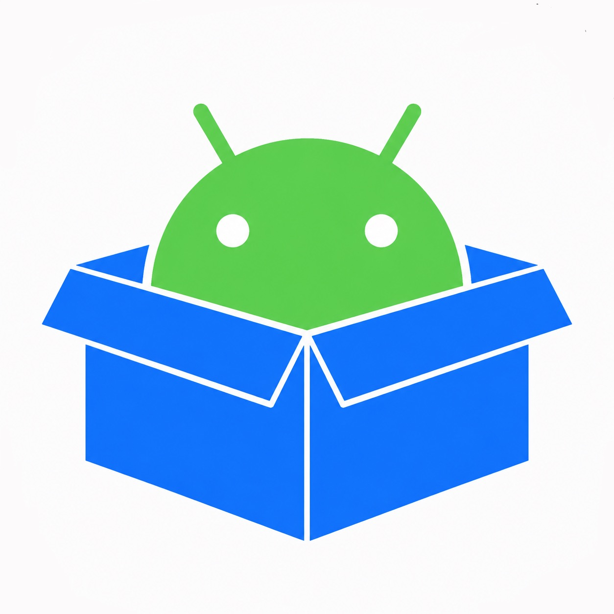

  

# APKContainer

Run Android .apk packages on iOS — a LiveContainer-style app that installs APKs on-device, shows them in a home-screen-like grid, and launches them inside a per-app container.

> This project is experimental and early-stage. See the capability matrix in docs/CAPABILITY_MATRIX.md for current status and known limitations.

---

## Quick summary

- Purpose: Provide a container that lets you install and run arm64 Android APKs on modern iPhone/iPad devices (arm64), with a focus on native-heavy apps and games.
- Not an emulator in the traditional sense — APKs target a different OS/runtime (Dalvik/ART, Bionic libc, Android native graphics and IPC).
- Target install method: Sidestore (https://sidestore.io/)

---

## Status

Early / architecture stage.

If you want to file issues, please read the "Why this is hard" and "Platform constraints" sections below first — many questions are answered there.

See docs/CAPABILITY_MATRIX.md for a feature-by-feature breakdown of what works today.

---

## Key constraints (read before filing issues)

Why running APKs on iOS is hard — two distinct problems must be solved:

1. Managed code
   - Most Android app logic ships as Dalvik/ART bytecode (`classes.dex`). You need an ART/Dalvik interpreter (or JIT) embedded or an AOT approach that translates DEX to native.
2. Native code
   - Many apps (especially games) include `.so` libraries built against Bionic libc and the Android NDK ABI. Those must be loaded and run inside a compatible native environment.

Important platform constraints that shape design and trade-offs:

- JIT is blocked on non-jailbroken iOS devices due to W^X and lack of the `dynamic-codesigning` entitlement. Options are:
  - Jailbroken devices (full JIT/interpreter possible),
  - Interpreter-only ART (works without JIT but is slower), or
  - AOT-compile DEX to a native binary at install time (requires a codesigning path).
- Unsigned native code: `.so` files from APKs are unsigned; iOS requires executable pages to belong to a codesigned binary.
- Per-app sandboxing: each APK gets its own writable directory that mimics Android's `/data/data/<package>` inside the iOS sandbox.
- 32-bit-only APKs (`armeabi-v7a`) are out of scope — iOS doesn't support 32-on-64 execution since iOS 11.

---

## Architecture (high level)

Planned build order and core components:

1. APK parser / installer
   - Unzip APK, parse AndroidManifest.xml and classes.dex, extract arm64 libraries (`lib/arm64-v8a/*.so`), icons/resources, and register the app in a local catalog (SQLite/plist). Create an on-disk per-app container.
2. DEX / ART execution layer
   - The core: embed or adapt an existing interpreter for Dalvik/ART bytecode, or implement a scoped DEX interpreter.
3. Bionic libc / native loader shim
   - Custom ELF loader for `.so` files, symbol resolution against a libc shim, and a JNI environment (`JNIEnv*`, `JavaVM*`) so native libraries can call back into the managed layer.
4. Graphics bridge
   - Provide an EGL/OpenGL ES shim that renders into a CAMetalLayer (via GL→Metal translation, ANGLE adaptation, or draw-call interception).
5. Input, audio, and lifecycle bridging
   - Map iOS input/audio/lifecycle events to Android equivalents (MotionEvent, audio buffers, Activity lifecycle).
6. Container UI
   - SwiftUI-based launcher grid, APK import via document picker, per-app details/uninstall, and a full-screen container view for running apps.

---

## Benchmark / integration target

Among Us (Unity/IL2CPP) is the main integration target — it exercises native code execution, GL rendering, multitouch, sockets, and audio.

---

## Requirements

- Device: modern iPhone/iPad (arm64)
- Sidestore to install the container app: https://sidestore.io/
- Sufficient storage for APKs

---

## Non-goals / Out of scope

- 32-bit (`armeabi-v7a`) APKs
- Full Android API parity with upstream Android
- App Store distribution (given the JIT and codesigning constraints, App Store distribution is unlikely)

---

## Contributing

Contributions are welcome. By opening issues or pull requests, you agree to the [APKContainer CLA](CLA.md).

If you're filing issues, please:

- Search existing issues and the capability matrix first.
- Include concrete repro steps and the APK (or a link) when possible.
- If the APK is large or proprietary, provide a minimal repro or logs.

See CONTRIBUTING.md (if present) for coding guidelines.

---

## License & contact

See LICENSE.md (if present) for the project's license.

For questions or collaboration, open an issue or reach out via the repository's discussions (if enabled).
